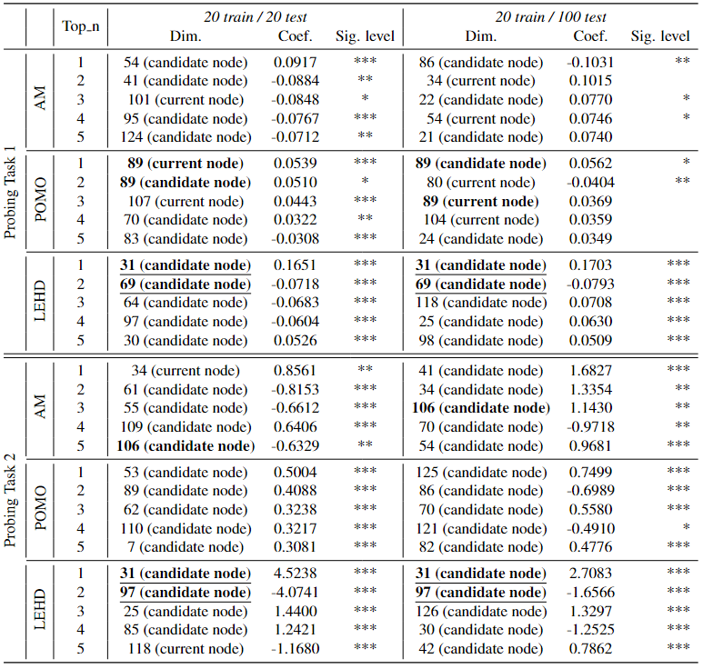

# [ICML2025_15421] Probing the Representations of Neural Combinatorial Optimization Models

## Tables
### Table A

_Table_ A. xxxxx 

### Table B

_Table_ B. xxxxx 

## Figures
### Figure A1 - A3
_Figure_ A1.

_Figure_ A2.

_Figure_ A3.

### Figure B1 - B3

_Figure_ B1.

_Figure_ B2.

_Figure_ B3.

### Figure C

_Figure_ C.

### Figure D

_Figure_ D.

### Figure E

_Figure_ E.

### Figure F

_Figure_ F.

## Codes

