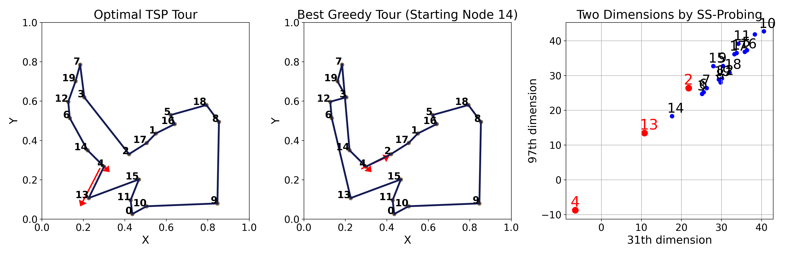
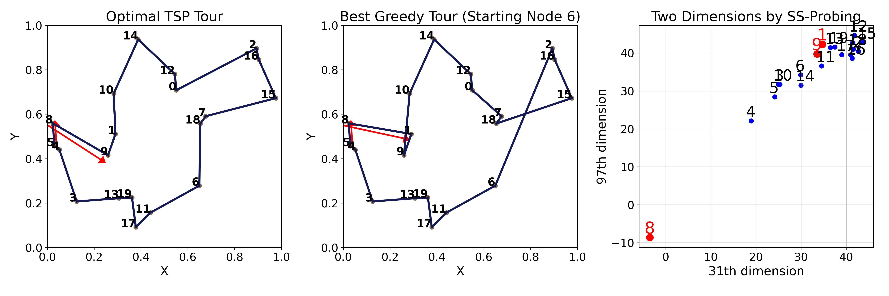
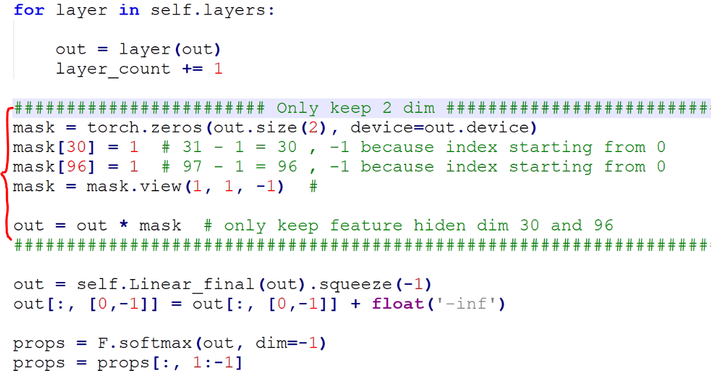

# [ICML2025_15421] Probing the Representations of Neural Combinatorial Optimization Models

## Tables
### Table A

_Table_ A. The table shows the SS-Probing results of AM, POMO, and LEHD on two probing tasks, specifically the top 5 dimensions with the largest absolute coefficients. The numbers indicate the dimension indices (starting from 1), with parentheses indicating whether the dimension comes from the current node or the candidate node. Bold entries highlight dimensions that are reused during generalization, and underlined entries further indicate that their relative ranking remains consistent. 

---

### Table B

_Table_ B. The table shows the results of using only two dimensions from LEHD’s output embedding before the softmax layer. The code can be found in Figure C. The “Results” column reports the gap to the optimal solution (lower is better). “All 128” refers to the original LEHD result using the full 128-dimensional embedding. 

---

## Figures
### Figure A1 - A3
_Figure_ A1. The four figures present the probing results of AM on Probing Task 1 (left two plots) and Probing Task 2 (right two plots), showing both the probe coefficients and their statistical significance. For each task, the top plot shows the result of the AM model trained and tested on 20-node instances, while the bottom plot shows the result of the same model (training on 20-node instances) generalized to 100-node test instances. In each plot, the left section (in purple) represents the results for 128-dimensional embedding of the current node, and the right section (in blue) represents the results for 128-dimensional embeddings of the candidate nodes—together forming a 256-dimensional results. Below each dimension is its significance level. Red vertical lines highlight the top-n dimensions by absolute coefficient magnitude (n = 1 to 5), with their ranks labeled above the lines. Note: if two top-n dimensions are close, the rank labels are slanted to avoid overlap.

---

_Figure_ A2. The four figures present the probing results of POMO on Probing Task 1 (left two plots) and Probing Task 2 (right two plots), showing both the probe coefficients and their statistical significance. For each task, the top plot shows the result of the POMO model trained and tested on 20-node instances, while the bottom plot shows the result of the same model (training on 20-node instances) generalized to 100-node test instances. In each plot, the left section (in purple) represents the results for 128-dimensional embedding of the current node, and the right section (in blue) represents the results for 128-dimensional embeddings of the candidate nodes—together forming a 256-dimensional results. Below each dimension is its significance level. Red vertical lines highlight the top-n dimensions by absolute coefficient magnitude (n = 1 to 5), with their ranks labeled above the lines.

---

_Figure_ A3. The four figures present the probing results of LEHD on Probing Task 1 (left two plots) and Probing Task 2 (right two plots), showing both the probe coefficients and their statistical significance. For each task, the top plot shows the result of the LEHD model trained and tested on 20-node instances, while the bottom plot shows the result of the same model (training on 20-node instances) generalized to 100-node test instances. In each plot, the left section (in purple) represents the results for 128-dimensional embedding of the current node, and the right section (in blue) represents the results for 128-dimensional embeddings of the candidate nodes—together forming a 256-dimensional results. Below each dimension is its significance level. Red vertical lines highlight the top-n dimensions by absolute coefficient magnitude (n = 1 to 5), with their ranks labeled above the lines. Red numbers along the x-axis indicate dimensions that share the same rank in both the top and bottom plots. Note: if two top-n dimensions are close, the rank labels are slanted to avoid overlap. 

---

### Figure B1 - B3

_Figure_ B1. The left plot shows the optimal solution for the instance, and the middle plot shows the greedy solution. The right plot visualizes the values of two key dimensions from the final node embeddings output by LEHD (before the softmax layer). For this instance, the current node is node 4. The myopic choice based on Euclidean distance would be node 5, while the correct choice in the optimal solution is node 3. In the two identified key dimensions, node 4 is indeed closer to node 3 than to node 5. Moreover, other nodes closer to node 4 in this space also appear nearby in the optimal solution sequence, further supporting our interpretation.

---

_Figure_ B2. The left plot shows the optimal solution for the instance, and the middle plot shows the greedy solution. The right plot visualizes the values of two key dimensions from the final node embeddings output by LEHD (before the softmax layer). For this instance, the current node is node 4. The myopic choice based on Euclidean distance would be node 2, while the correct choice in the optimal solution is node 13. In the two identified key dimensions, node 4 is indeed closer to node 13 than to node 2.

---

_Figure_ B3. The left plot shows the optimal solution for the instance, and the middle plot shows the greedy solution. The right plot visualizes the values of two key dimensions from the final node embeddings output by LEHD (before the softmax layer). For this instance, the current node is node 8. The myopic choice based on Euclidean distance would be node 1, while the correct choice in the optimal solution is node 9. In the two identified key dimensions, node 8 is indeed closer to node 9 than to node 1, even though the difference is small. This is consistent with the node distribution shown in the left two plots, where nodes 9 and 1 are very close to each other, and their distances to node 8 differ only slightly.

---

### Figure C

_Figure_ C. The figure shows that we only added five lines of code to the LEHD. By directly cloning the LEHD project from GitHub and adding the five lines shown in the figure, you can directly run its test script as-is and obtain the results shown in Table B.

### Figure D

_Figure_ D. A classifier is trained using only the raw path feature (namely distance) as input. The left plot shows the label distribution, and the right plot presents the ROC results.

### Figure E

_Figure_ E. The four plots show the SS-Probing results during the training process of the LEHD model.

## Codes

The folder “1_data_gen” contains the code for collecting instance datasets.

The folder “2_NCO_emb_extract” provides the code for extracting different embeddings from LEHD and POMO.

The folder “3_probing_exp” contains the code for running the probing experiments.

